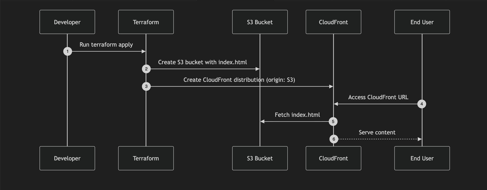

# Terraform Demo with AWS S3 and CloudFront

## Overview
This project is a Terraform demo that provisions AWS infrastructure to host a simple webpage. It includes:

- **S3 buckets** for storing static content.
- **CloudFront distributions** to serve content globally.
- **Simulated environments**: development, QA, and production.
- **CI/CD workflows** using GitHub Actions to deploy and promote changes safely.

It’s intended as a beginner-friendly example of Infrastructure as Code (IaC), environment isolation, and automated deployments.


*Diagram showing how Terraform provisions S3 and CloudFront, and how users access the webpage.*

## Prerequisites
- Terraform v1.6+
- AWS CLI configured with appropriate credentials
- GitHub account (for GitHub Actions CI/CD)
- Basic knowledge of AWS S3 and CloudFront

## CloudFront Distributions
The following CloudFront distributions that I have provisioned serve the webpage hosted in each environment:


**dev:** https://do3wrs8fapq5e.cloudfront.net

**qa:** https://d2z1dwdrnegcbn.cloudfront.net

**prod:** https://d1vrl10xp6tnjy.cloudfront.net

## Commands
Upload a file to an S3 bucket
```sh
aws s3 cp index.html s3://myBucket
```

Terraform commands
```sh
terraform fmt # lints terraform code
terraform validate # validates terraform code
terraform plan # see the changes that will be made (doesn't execute anything)
terraform apply # apply terraform changes
```
