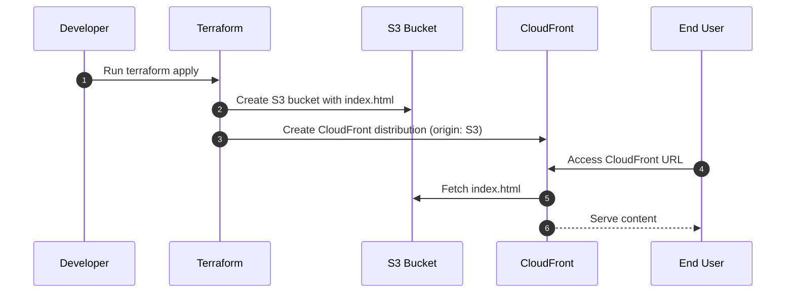

```mermaid
    sequenceDiagram
    autonumber

    participant Dev as Developer
    participant TF as Terraform
    participant S3 as S3 Bucket
    participant CF as CloudFront
    participant User as End User

    %% Infrastructure Provisioning
    Dev->>TF: Run terraform apply
    TF->>S3: Create S3 bucket with index.html
    TF->>CF: Create CloudFront distribution (origin: S3)

    %% User Access
    User->>CF: Access CloudFront URL
    CF->>S3: Fetch index.html
    CF-->>User: Serve content
```